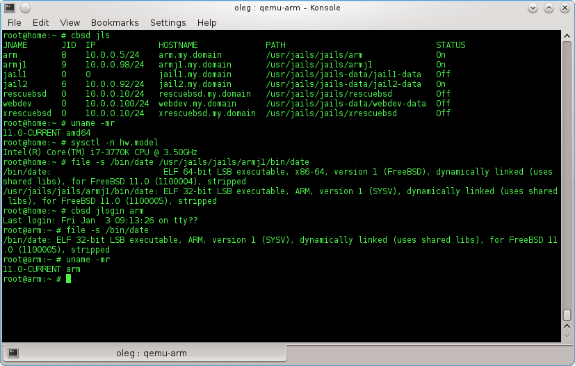

# CBSD and Qemu User mode

Having installed QEMU in the master node, builded with additional targets **user mode** (\*-user) ( [https://wiki.freebsd.org/QemuUserModeHowTo](https://wiki.freebsd.org/QemuUserModeHowTo)), you can create jails with alternative architectures other than the master host. At the same time, will be achieved through emulation emulator Qemu, it is completely transparent — if the binary has a non-native architecture, it can perform in this system without having to install a complete Qemu virtual machine.

To **CBSD** could create such jail, binary of Qemu, providing this architecture in **usermode**, must be built statically, because the file will be placed inside the jail.

Why it can be useful at all?

First of all, it's a fairly simple way to test the binary FreeBSD specific software architecture in the native environment, while you do not need to search for bootable distribution and install FreeBSD desired architecture on a separate drive from scratch.

Secondly, many owners of ARM-based devices suffer from a lack repository **pkg** for ARM architectures, and building of the packages directly on very limited resources for capacity themselves Embedded ARM-based devices — to put it mildly, quite sad operation.

ARM-based jail, running on a powerful x86-64 system will allow you to build the necessary packages, you'll have to install Embedded device via a standard **pkg** in binary form.

According to test results, the loss of speed in the work under QEMU emulator varies from 3% to 25%, for example, in comparison with the power of such devices as **RPi-B**, modern x86-desktop in any case much faster.

Currently tested jail work on **armv6** and **mips64** architectures.

Note: because the program will run under qemu, they are have default limit of RAM 128MB, that can lead to crashes some fat processes. I have not found in haste as through user mode tools (qemu-arm, qemu-mips64) indicate -**m XX** , so you can simply adjust the desired volume in the file vl.c QEMU, specifying such

```
#define DEFAULT_RAM_SIZE 512
```


