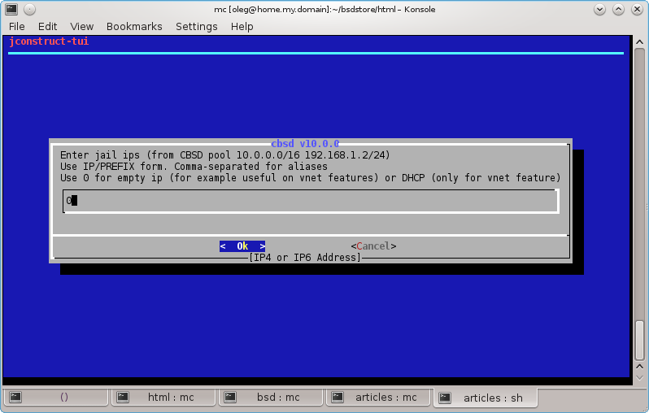
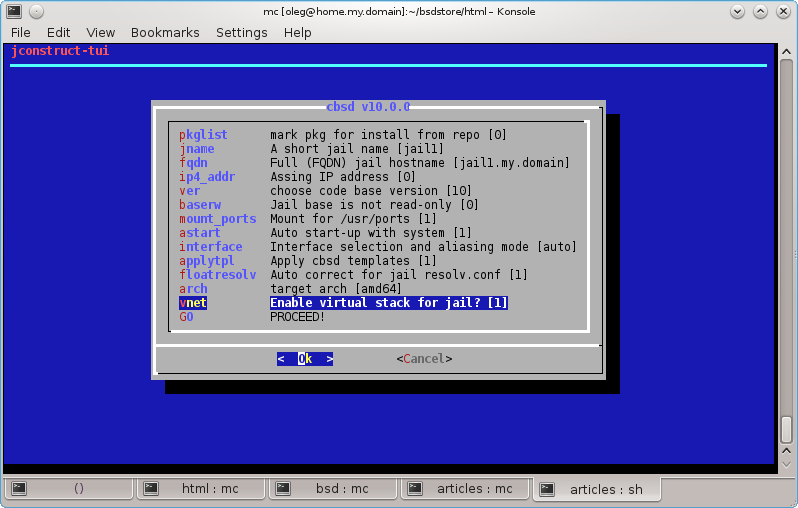
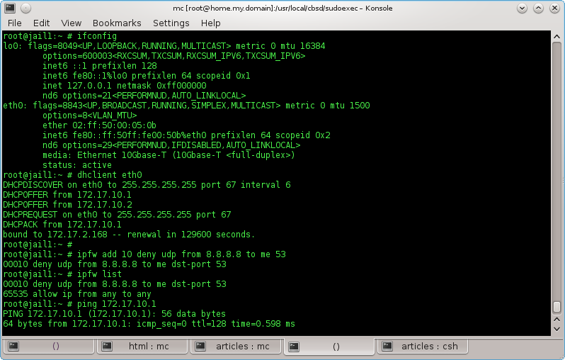

# CBSD FreeBSD jail with VIMAGE (vnet)

In view of some of the subtleties with FreeBSD vnet-jail, information about it warranted this separate article. First of all, the **VIMAGE** functionality requires a customized kernel with

```
option VIMAGE
```

if you get a kernel from the repository through a command **cbsd**:

```
% cbsd repo action=get sources=kernel
```
then your kernel has support for VIMAGE.

If your kernel does not have the **VIMAGE** option built in, the parameter vnet in the file `${workdir}/nc.inventory` will always be set to **0**. If this option is present in the kernel, in the jail creation dialog the parameter will default to **vnet**.

vnet-featured jail has at its disposal a fully virtualized and isolated network stack, which in turn allows the use of a private jail (albeit virtual) interface, "right" **loopback**, use within the jail a packet filters [pf, ipfw, pfilter](https://www.freebsd.org/doc/handbook/firewalls-pf.html), raise the tunnels and reconfigure the routing table.

When you create a vnet-jails the **ip4_addr** should indicate **0**, which prohibit **CBSD** set itself an IP address for vnet jail.

*Note: The installation of IP addresses in the vnet jail is not implemented yet*

Also, if you want to get a jail itself an IP address automatically (via DHCP), you would write a separate section devfs.rules, in which you need to open [bpf(4)-device](http://www.freebsd.org/cgi/man.cgi?query=bpf&sektion=) ( unhide bpf*).

For example, append in the file `/etc/devfs.rules`:

```
[devfsrules_jail=4]
add include $devfsrules_hide_all
add include $devfsrules_unhide_basic
add include $devfsrules_unhide_login
add path zfs unhide
add path 'bpf*' unhide
```

and set this devfs rule number (4) to **vnet**-jail (via **cbsd jconfig jname=XXXX**)

Also, if you completely trust the container and the applications that are running in it (those it's yours), you can use devfs rules in the container settings specify any non-existent rule number, for example '99'. Or, select the profile type 'trusted' when creating the container through cbsd jconstruct-tui. In such cases, inside the container will be all devices devfs

CBSD creates virtual interfaces using a pair of [epair(4)](http://www.freebsd.org/cgi/man.cgi?query=epair&sektion=4), but the "other end" virtual cable that connects to the jail, **CBSD** renamed to **eth0** interface.

*Note: : Rename this is relevant only for FreeBSD jails. If a jail is run as Linux-based, renaming will not happen.*

Renaming to **eth0** by the fact that each new epair increments the number of the interface, those of the first **vnet**-jail in original, interface will be called as epair**0**a. When you running the fifth of jails, in last jail interface will be called as epair**5**a. It's not very convenient whith jail migrating (on another server, it may be a different number), and definitely not convenient that every time you have to correct the contents of the rc.conf with the network setup.

 *Sets 0 (empty) in ip4_addr field when create vnet-jail*



 *If the kernel has VIMAGE option, it is possible to set the vnet 1*



 *Inside the jail. We do what we want, we get your IP, set up ipfw*


