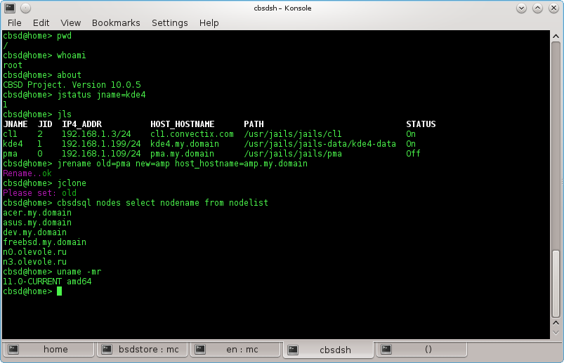

# About CloneOS shell and SQLite3


Almost all **CloneOS** code is written in **sh** for the following reasons:

* Unlike interpreters for bash, perl, python etc. the **sh** interpreter comes in at just over 100 KB. This creates a lot less overhead
* **CloneOS** is geared towards system engineers, who may not know **Perl**, **Python**, **Lua**, **C**, or **Go**  etc., but shell scripting is a key skill in this field (or at least should be ;-)
* There is no need for a lot of parsing or use mathematical functions. We are mainly working with external tools or APIs

Nevertheless, **sh** comes with many restrictions (mainly when working with lines) which make writing scripts difficult. To alleviate this **CloneOS** comes with its own fork of /bin/sh which brings the additional functionality described in this document

So if you want to change/add somethin in **CloneOS** or its modules, you have enough knowledge on the usual sh and extend several function.

## cbsdsh

cbsdsh modified version of /bin/sh currently has the following additions to regular /bin/sh:

  *  Added strlen to determine the length of a string
  *  Added function is_number to determine whether the number is.
  *  cbsdsh linked with SQLite3 to SQL databases to be able to work inline in the shell and thus scenarios:

```
cbsd@home> pwd

/tmp

cbsd@home> uname -r

11.0-CURRENT

cbsd@home> cbsdsql local SELECT dsk_controller,dsk_path,dsk_slot FROM bhyvedsk WHERE jname=\"debian1\"

ahci-hd|dsk1.vhd|0

cbsd@home>

```

* Added function cbsdsql as built-in shell function to query in SQL, as the second argument is the base, all other - the SQL query itself. As the name of the database file name appears directly in *`$workdir/var/db/`*, while the path and file extension *.sqlite* should not be written. For example, if you want a list of jails with remote nodes node2, information which is in SQLite file *`/usr/jails/var/db/node2.sqlite`* and the contents of which (in new versions of CBSD) is replicated from a source in the shell so you can write:

```
...
cbsdsql node2 SELECT jname FROM jails

```

or assign the result SQL command shell-variable, then disassembled it to selected variables:

```
_res=$( cbsdsh local SELECT ip4_addr,jname,status FROM jails )
sqllist ${_res} ip4_addr jname status
echo "Jail name: ${jname}; IPs: ${ip4_addr}; Jail status: ${status}

```

If you are in cbsdsh, then you do not need to enter the prefix cbsd before the CBSD command:



The SQLite3 in CBSD is used to store the jail settings for the following reasons:


  *  To store, and especially to work with so many parameters in normal ascii-files is very hard
  *  SQLite3 does not require a running DB server and is highly portable
  *  For reasons beyond our control, many OS utilities may change their methods of storage. For example, up until FreeBSD version 10, jails were configured via the command line, but beginning in version 10 jails are started with their own config files in YAML. To not suffer from such changes and rewrite all the scripts work with these configs bred in a single procedure, the rest of the subsystem work with their "non-volatile" API. In addition, SQL database is a "universal" storage from which you can easily create any other noSQL/xml/yaml data
  *  Instead SQLite3 can be easily linked with an external database MySQL, PgSQL, which will act as a central "registry" for the entire farm, with no need to rewrite the script. Also, data replication from node to node is not needed because all nodes update and read one the central registry.
  *  Each node on the record works only with its own SQLite3 file (symbolic link `$workdir/var/db/local.sqlite`), all files deleted nodes are in the same directory but under their own names , so the local node does not work depending on the status information from a remote node.


Modules and command who have little work with external tools, but with a lot of strings work and mathematics (helpers CBSD for some services, among them), it is convenient to write in LUA (which is not yet built into cbsdsh ;-) )
