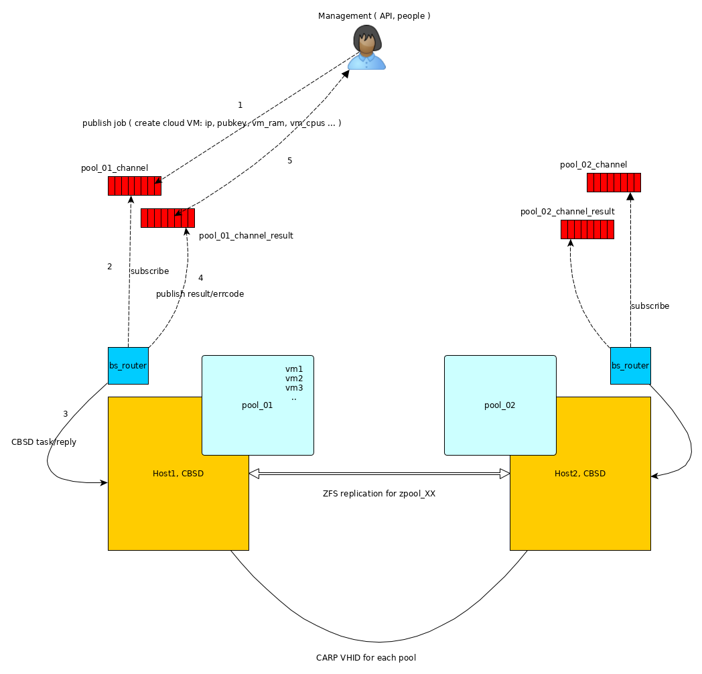
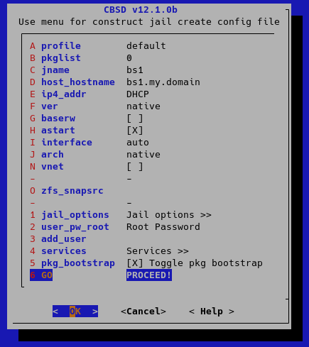

**CBSD** was developed in terms of user-friendly, taking into account
the convenience for the user during interactive work. You may ask:
well, interactive dialogs are wonderful. But what if you have the task
of building a scalable cluster, where higher-level logic will manage the
virtual machines, and for this reason, we don't need interactive
commands&mdash;can **CBSD** be useful for you in this case?

This article describes an example of creating and managing a **CBSD**
cluster via an asynchronous interface using a minimalistic and fast
[net/beanstalkd](http://xph.us/software/beanstalkd/) broker. Instead of
**beanstalkd**, any other broker can act, such as ActiveMQ, ZeroMQ,
RabbitMQ or Kafka. By convention, let's call this a low level of
virtual machine management, which provides delivery and return of
results when managing virtual machines, such as creating a VM, adding a
disk, creating a snapshot, migration, cloning, changing the VNC port,
etc. At a higher level may be your application (controller).

We will use multiple **CBSD** workspaces, when some resources can be initialized in the separated directory.
This opens opportunities for building pool-binded methods for hosting virtual machines.
Pool-binded cluster means that all services or virtual machines of the cluster will be tied to one or another pool, which can move from one server to another in emergency situations, during DRS operation or equipment maintenance. 
Thus, it can become the basis for building a '[shared nothing cluster](https://en.wikipedia.org/wiki/Shared-nothing_architecture)' based on FreeBSD and **CBSD**.



The creation of a failover cluster will be described in a more extended
article, here we will restrict ourselves to several **CBSD** working
environments to demonstrate the operation of the asynchronous interface
through an broker bus.
We assume that **CBSD** is already installed and configured on the server. 
We need a **beanstalkd** service that acts as a shared bus for all agents. 
Let's put **beanstalkd** in jail on our server. To do this, create a jail with an arbitrary name in which **beanstalkd** will be launched, for example, **bs1** (assign the container the correct working IP address, we need it):



``` sh
cbsd jconstruct-tui
cbsd pkg jname=bs1 mode=update
cbsd pkg jname=bs1 mode=install net/beanstalkd
cbsd sysrc jname=bs1 beanstalkd_enable=YES
cbsd jstart bs1
```

Then, we initialize two independent environments (in a real cluster,
these can be different pools and, of course, there may be more), for
example, in /pool1 and /pool2 directories:

``` sh
env workdir=/pool1 /usr/local/cbsd/sudoexec/initenv
```

To the question of changing the rc.conf file, answer 'n', this
initialization should not modify your main configuration files.

To the question of enabling NAT (nat\_enable: Enable NAT for RFC1918
networks?) answer "no" - it should already work for you on the main
system.

Repeat the same for the second environment:

``` sh
env workdir=/pool2 /usr/local/cbsd/sudoexec/initenv
```

with similar answers.

Now, **CBSD** can work in these environments through the workdir
variable, for example:

``` sh
env workdir=/pool1 cbsd jconstruct-tui
env workdir=/pool2 cbsd jconstruct-tui
```

etc..

Each environment will be served by a small agent (let's call it
bs\_router) which will connect to beanstalkd and process requests. Lets
clone it:

``` sh
cd /root
git clone https://github.com/cbsd/bs_router.git /root/bs_router
```

The example is written in GO, so to build the project we need for
golang:

``` sh
pkg install -y lang/go
```

Build:

``` sh
cd bs_router
setenv GOPATH /root/bs_router
go get
go build
cp -a bs_router /usr/local/sbin
```

Now copy the configuration file and adjust for each pool:

``` sh
cp -a config.json /usr/local/etc/pool1.json
cp -a config.json /usr/local/etc/pool2.json
```

In both files, please change:

-   **uri** - instead of 127.0.0.1:1130, set IP address of bs1 jail,
    e.g: **172.16.0.3**:1130 (if bs1 has IP 172.16.0.3)
-   **cbsdenv** - for pool1.json config it will be pointed to /pool1,
    for pool2.json - /pool2
-   **tube** - which pipe to subscribe to, for pool1.json config let it
    be "cbsd\_pool1", and for pool2.json - cbsd\_pool2
-   **reply\_tube\_prefix** which pipe do we use for reply. For
    pool1.json let it be: cbsd\_pool1\_result\_id, and for pool2.json -
    cbsd\_pool2\_result\_id

Now start both agents with the configuration file via command line:

``` sh
/usr/local/sbin/bs_router -config /usr/local/etc/pool1.json
/usr/local/sbin/bs_router -config /usr/local/etc/pool2.json
```

That's it, now everything that we will send to the beanstalk queue with
the corresponding name and the corresponding payload in json format will
be transmitted to **CBSD** and a response will be received.

As an example, we clone a client sample to our CBSD agent, which will
connect to beanstalkd and send requests:

``` sh
cd /root
git clone https://github.com/cbsd/bs_router-client.git
cd bs_router-client
setenv GOPATH /root/bs_router-client
go get
go build
```

As a result, we got the **bs\_router-client** binary file, which can now
be used to send and receive tasks to different **CBSD** environments.
Take a look at the bin.jail and bin.bhyve directories for examples of
use.

When working with cloud images, it makes sense to first 'warm up' all
the cloud images so that the creation of the first virtual machine does
not slow down the process, for example, for pool1 this can be done like
this:

``` sh
env workdir=/pool1 cbsd fetch_iso keepname=0 conv2zvol=1 cloud=1 dstdir=default
```

After this command, you can use the result of executing the scripts
`/root/bs_router-client/bin.bhyve/bcreate.sh` and `/root/bs_router-client/bin.bhyve/bstart.sh` without delay.
