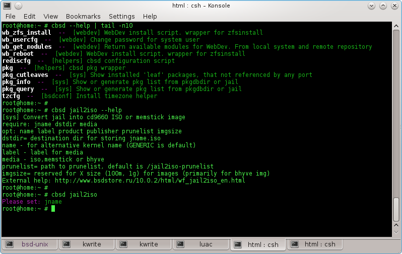
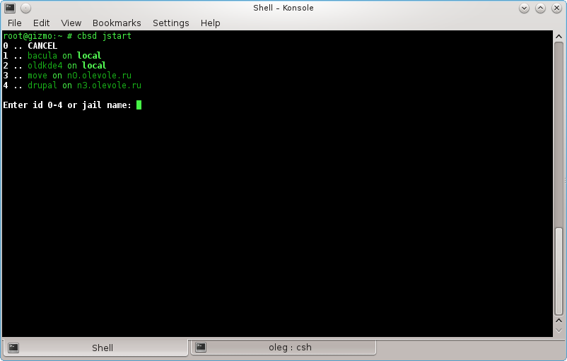
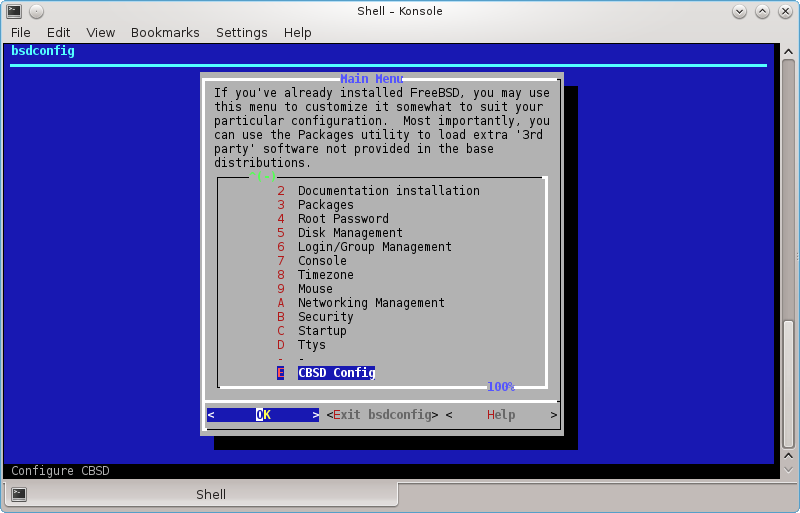
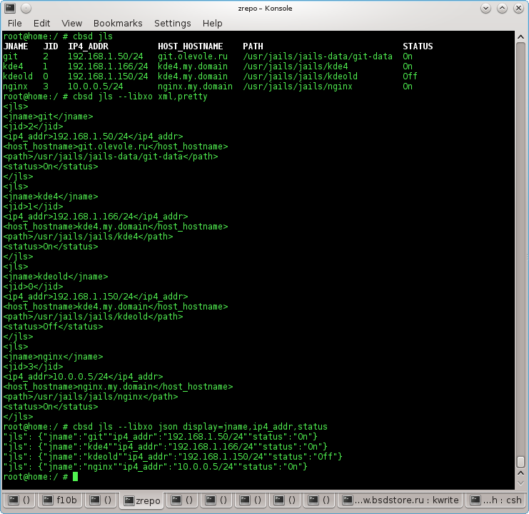

# CBSD syntax

All commands begin with cbsd prefix (if you not in [CBSD CLI](https:cbsd.io/en/cbsd/docs/cbsdsh/#cbsdsh)):

```
% cbsd jls
% cbsd jstop jname
% cbsd jstart jname
% cbsd node mode=list
```

Commands of **CBSD** can accept arguments that are written in the form `param=value`. **CBSD** commands can have as required arguments, and the arguments are optional. Order of the arguments does not matter.

## Command arguments and description

In order to get brief information about a particular script, and get a list of required and optional arguments use the --help argument for the corresponding command

```
% cbsd <cmd> --help
```

For example, to get help on jls:

```
% cbsd jls --help
```
Result:

        [jail] List jail and status
        require:
        opt: alljails shownode display node header
        alljails=1 - get jaillist from remote node
        shownode=1 - show nodename for jails
        node= only for current node
        header=0 don't print header
        display= list by comma for column. Default: jid,jname,ip4_addr,host_hostname,path,status
        External help: http://www.bsdstore.ru/10.0.2/html/wf_jls_en.html


The first line in square brackets the name of the module to which the command (jail in this case), as well as a summary of the functions.
In line with **require**: lists the required arguments, without specifying which command work impossible.
In line with **opt**: lists the optional arguments (though, depending on the mode of the utility, in various cases, they may be required)
In the following lines is a brief description of the arguments, if it exist
Also, it may be a reference to the documentation (External help). It can point to a site and a local file, if installed documentation.



Some of the commands waiting in as a parameter the name of the jails, can be interactive, with a list of jails (including from remote nodes) to choose from. To do this, just run the command with no argument. Examples of these commands:

**cbsd jlogin, cbsd blogin, cbsd jconfig, cbsd bconfig, cbsd jstop, cbsd bstop, cbsd jstart, cbsd bstart**, etc...



In addition, **CBSD** installed as a module for base tools **bsdconfig** (adds itself to the end of the list), which grouped some -tui utility, so some controls CBSD you can perform through the interactive interface, running **bsdconfig cbsd**.



## Interactivity, the color in the output result

By default, the console output is produced in color. If the color is prevents to you (for example, you use some of his script to work with **CBSD** command), you can use the environment variable parameter NOCOLOR=1

```
% cbsd jls
% env NOCOLOR=1 cbsd jls
```

Some commands may be interactive - during a predetermined correction question. For example, if you run the jail, demanding base FreeBSD 10.1 and this base you do not, **CBSD** will ask to download database

This behavior may not be suitable if you write your scripts around **CBSD**. In this case, you can append the parameter **inter=0** in each command. this causes **CBSD** decide by default when there is an interrogative situation

```
% cbsd jstart inter=0 jname=XXX
% cbsd jcreate inter=0 jconf=/path/to/jconf
```

## CBSD command debuging

For enable debugging via **sh xtrace** and trace all operation, use **CBSD_DEBUG** environment variable:

```
% env CBSD_DEBUG=1 cbsd node mode=add node=192.168.1.222 pw=very_strong_plain_password port=22
% env CBSD_DEBUG=1 cbsd jls
```

## Output in XML, JSON, HTML and human-readable format

Since 10.1.5, **CBSD** can display information not only to understand the human form, but also in HTML, XML and JSON for easy machine parsing and simply for the cyborgs joy


