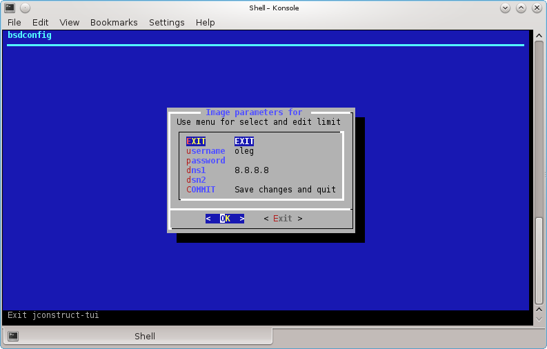
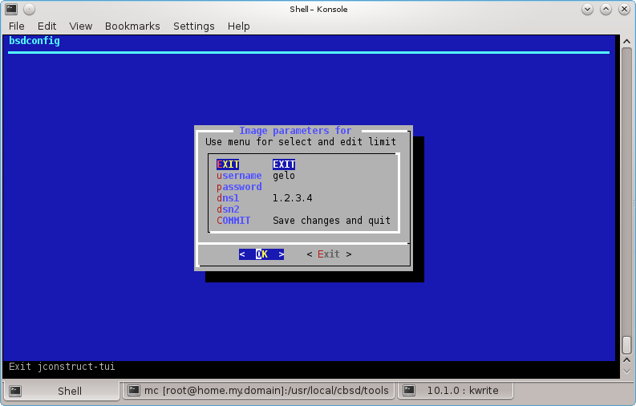
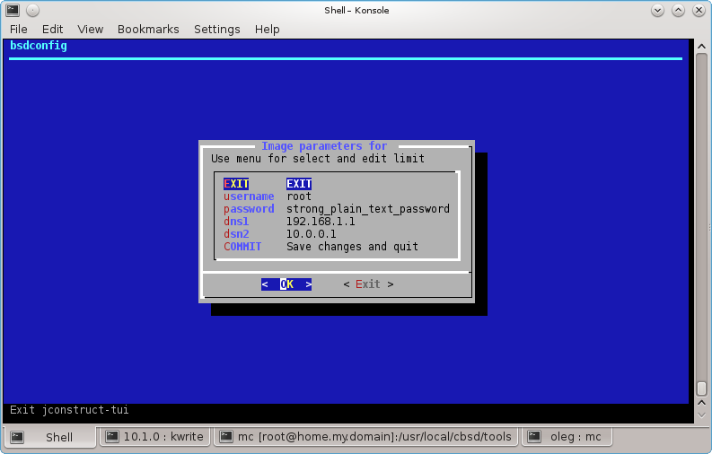

# How does a helper for CBSD image

**command: *imghelper* **

```
% cbsd imghelper
```

** Description:**

Prebuilt images for **CBSD** represent an archive of environment and a sequence scenario, formed by one of the configurations derived from the state of the environment.

Since most of the modifications associated with personal data (passwords, user names or domain name databases, etc.), to mining scenario must be received all necessary parameters - sta je ovde pisac hteo da kaze? da budemo sigurni da mu trebaju svi parametri? Starting with version **CBSD** 10.1.0, entering the settings dialog executes the script imghelper, which takes parameters for construction of the SQLite3 database that runs along with the jail

Here we will analyze the construction of the classical dialog-based menu.

In SQL schema file format, the following described format is used for testing CBSD updatesql:

```
CREATE TABLE forms (  idx INTEGER PRIMARY KEY AUTOINCREMENT, param TEXT DEFAULT NULL UNIQUE, \
desc TEXT DEFAULT NULL, defaults TEXT DEFAULT NULL, mandatory INTEGER DEFAULT 0, \
attr TEXT DEFAULT NULL, xattr TEXT DEFAULT NULL  );

```

Where:

* **forms** - is a constant, a table name that imghelper will look when opening a file forms
* **idx** - table index. When building forms are not used
* **param** - Arbitrary name argument (usually - one word), a parameter whose value we should get
* **desc** - Any description for the argument
* **defaults** - The proposed default value. May be empty.
* **mandatory** - boolean (0,1), a sign of commitment. If the parameter is mandatory, will not be able to run the script with an empty argument value
* **attr** - System field for different attributes in this release/document it will not use
* **xattr** - System field for different attributes when building WEB/HTML forms, in this version/documentation it will not use

For example, for wordpress from CBSD repo generation base occurs so: [initforms.sh](https://github.com/cbsd/cbsd-scenes/blob/master/img/wordpress/wordpress/bin/initforms.sh)

When cbsd imghelper executed specifies the path to the file (in the preparation of image through cbsd repo, the operation is done automatically).

There are three ways to enter the required parameters for **cbsd imghelper** before it will run the installation script:

* Interactive mode: used to draw the dialog UI, parameters and input fields. By filling that button "COMMIT" initializes the install script
* Interactive and non-interactive, Method 1: Specify the parameters in the command line: cbsd imghelper param1 = val1 param2 = "this is arg for param2" ... In this case, if all the fields have values, the script will run automatically
* Interactive and non-interactive, methods are exactly 2: specify parameter values using environment variable species H_param. This method can also kobminirovatsya interactive mode when the environment variables will act as a "writable" or default values in the dialog, allowing you to build a partially completed forms

Non-interactive mode is useful for the installation of the cell automatically, without interruption for input

A practical example

Create a file with a form to enter the 4 parameters: *username, password, dns1, dns2*. To do this, create an empty table in the file `/tmp/forms.sqlite`:

```
% sqlite3 /tmp/forms.sqlite
sqlite> CREATE TABLE forms (  idx INTEGER PRIMARY KEY AUTOINCREMENT, \
param TEXT DEFAULT NULL UNIQUE, desc TEXT DEFAULT NULL, defaults TEXT DEFAULT NULL, \
mandatory INTEGER DEFAULT 0, attr TEXT DEFAULT NULL, xattr TEXT DEFAULT NULL  );
sqlite> ^D
```

Fill in the table we need parameters

```
% sqlite3 /tmp/forms.sqlite << EOF
INSERT INTO forms ( param,desc,defaults,mandatory,attr ) VALUES ( "username","Please enter user name","oleg",1, "maxlen=10" );
INSERT INTO forms ( param,desc,defaults,mandatory,attr ) VALUES ( "password","Please enter password","",1, "maxlen=15" );
INSERT INTO forms ( param,desc,defaults,mandatory,attr ) VALUES ( "dns1","Please enter DNS1","8.8.8.8",1, "maxlen=15" );
INSERT INTO forms ( param,desc,defaults,mandatory,attr ) VALUES ( "dsn2","Please enter DNS2","",1, "maxlen=15" );
EOF
```
As you can see, all the fields are mandatory. Thus, the value of the parameters *username* and *dns1* The default is predetermined and offers equal oleg and *8.8.8.8* respectively

```
% cbsd imghelper /tmp/forms.sqlite
```



Also, we can determine in advance the parameters via the command line (after having received the names of the variables in terms of --help):

```
% cbsd imghelper /tmp/forms.sqlite --help
[sys] Ncurses-based jail image boostrap helper
require: formfile
opt:  username password dns1 dsn2
External help: /usr/local/share/doc/cbsd/wf_imghelper.html
        % cbsd imghelper /tmp/forms.sqlite username=gelo dns1="1.2.3.4"
```



Finally, we can simply use the environment variables:

```
% setenv H_username root
% setenv H_password strong_plain_text_password
% setenv H_dns1 192.168.1.1
% setenv H_dsn2 10.0.0.1
% cbsd imghelper /tmp/forms.sqlite
```


