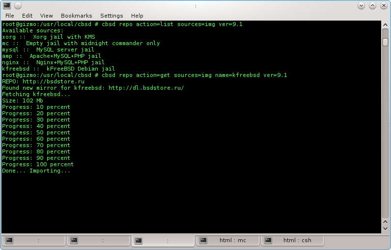
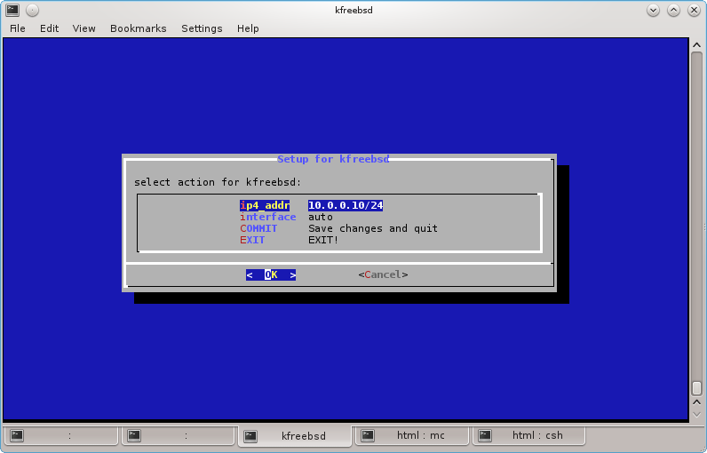
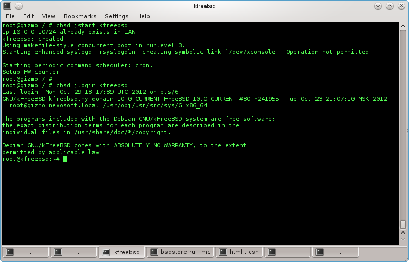

# Operation with repository

## repo command

```
% cbsd repo
```

```
% cbsd repo-tui
```

**Description:**

Work with a repository of bases, kernels and images. The quantity a repository can be more than one and they are specified through a gap in the file repo variable `$workdir/nc.inventory`. Downloading will occur from the first repository where the object will find. Respectively, if the local repository is used — it should be the first.

obligatory parameters:

 **action** — can accept value list (get list), get (download), put (upload)

Arguments which in certain cases aren't obligatory:

 **sources** — sources for action — with what data we want to work. Can accept values:

  - *src* — source code for OS (${workdir}/src)
  - *obj* — object file for source code ($workdir}/obj)
  - *base* — world/bases ($workdir/base)
  - *kernel* — kernels of OS (${workdir}/base)
  - *img* — jails

+ **name** — name (used with sources=obj,base,kernel,img — name of base/world or jails)
+ **stable** — related to sources=obj,base — get RELENG_X instead of RELENG_X_Y
+ **ver** — By default, for obtaining the list or downloading the current version of OS will be used. With the ver=X.Y parameter it is possible to specify other version for jail/base/kernel. At ver=any for action=list, will be it is deduced all available data of sources for all versions

**Example:**

Obtaining the list of available jails for 9.1 versions

```
% cbsd repo action=list sources=img ver=9.1
```

to get and import kfreebsd jail:

```
% cbsd repo action=get sources=img name=kfreebsd
```



Upon termination of an import the question of correct IP for a new jails will be asked and whether to create alias automatically. We choose COMMIT for preservation.



Now jail in system also it is possible to use


